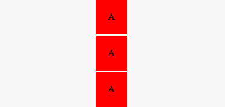
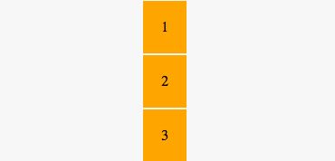

## Prova scritta - Digital Mockup 


###### Nome e Cognome: ………………………………….


##### 01 - Osserva il seguente frammento HTML e scegli la risposta corretta

```html
<div class="black">
	<p>C'era una <i>volta</i> un <strong>lupo</strong></p>
</div>
```

- [ ] La parola `volta` è in **bold**
- [ ] La parola `lupo` è in **bold**
- [ ] Tutta la frase è in *italic*
- [ ] La parola `lupo` è forte

---

##### 02 - Osserva il seguente frammento HTML e scegli la risposta corretta

```html
<h1>Testo 1</h1>
<h3>Testo 2</h3>
<h6>Testo 3</h6>
<p>Testo grande</p>
```

- [ ] `Testo 1` è più piccolo di `Testo 2`
- [ ] `Testo 2` è più piccolo di `Testo 3`
- [ ] `Testo 1` è più grande di `Testo 2`
- [ ] `Testo grande` è più grande di `Testo 1`


---


##### 03 - Osserva il seguente frammento HTML e scegli la risposta corretta

```html
<style>
#main{
  background-color: orange;
  color: blue;
}
#notice{
  color:red;
}
</style>

<h1>Titolo</h1>
<h3 id="main">Sottotitolo</h3>
<p class="notice">Testo corto</p>
<p>Testo lungo</p>
```

- [ ] `Testo corto` è nero
- [ ] `Testo corto` è blu
- [ ] `Testo corto` è rosso
- [ ] `Testo corto` è arancione

---


##### 04 - Osserva il seguente frammento HTML e scegli la risposta corretta

```html
<style>
.container{
  display:flex;
  flex-direction: row-reverse;
  align-items:center;
  justify-content: space-between;
}
.item{
	background-color:orange;
	flex:1;
}
</style>


<div class="container">
  <div class="item">1</div>
  <div class="item">2</div>
  <div class="item">3</div>
</div>
```

- [ ] 
- [ ] 
- [ ] 
- [ ] 


---

##### 05 - Osserva il seguente frammento HTML e scegli la risposta corretta

```html
<style>
#container{
  	background-color: red;
	color:blue;
	transition: background-color 1s;
}
#container:hover div{
	color:yellow;
}
#container:hover{
	background-color:yellow;
}
</style>


<div id="container">
    <div class="item">testo</div>
</div>
```

- [ ] Il background-color viene animato all'hover diventando giallo
- [ ] Il background-color viene animato all'hover diventando rosso
- [ ] Il colore del testo viene animato all'hover diventando giallo
- [ ] Nulla viene animato


---

##### 06 - Osserva il seguente frammento HTML e scegli la risposta corretta

```html
<style>
#container{
  width:100%;
  height:100%;
  display:flex;
}
.item{
    flex:1;
    background-color: green;
}
.item.a{
    background-color: red;
}
.item #a{
    background-color: orange;
}
</style>


<div id="container">
    
    <div class="item a">1</div>
    <div class="item"><div id="a">2</div></div>
    <div class="item">3</div>
    
</div>
```

- [ ] Il div con l'`1` è verde
- [ ] Il div con il `2` è rosso
- [ ] Il div con il `3` è verde
- [ ] Il div con il `2` è verde


---

##### 07 - Osserva il seguente documento HTML e scegli la risposta corretta


```css
html, body{
  width:100%;
  height:100%;
  overflow:hidden;
}

#container{
  display:flex;
  justify-content:center;
  align-items:center;
  width:100%;
  height:100%;
}
#a{
  background-color: green;
  position: absolute;
  width:100px;
  height:100px;
  top:0;
  left:0;
}
#b{
  background-color: red;
  position: fixed;
  right:0;
  bottom:0;
  width:100px;
  height:100px;
}
.tool{
  position:relative;
  background-color: orange;
  width:100px;
  height:100px;
}
```

```html
<div id="container">
    <div id="a"></div>
    <div id="b"></div>
    <div class="tool"></div>
</div>

```

- [ ] i 3 quadrati sono tutti allineati in centro
- [ ] i 3 quadrati sono allineati a destra
- [ ] un quadrato è in centro
- [ ] il quadrato rosso è allineato a sinistra

